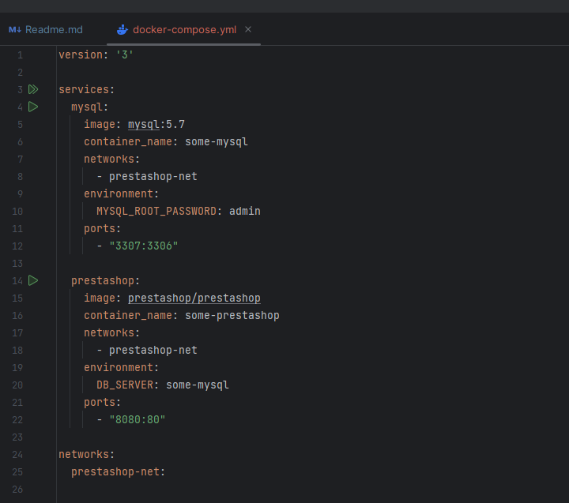

# Examen Docker

1º El primer paso que tenemos que hacer es crear un contenedor con la imagen de Prestashop esta la podemos encontrar en [**docker hub**](https://hub.docker.com/r/prestashop/prestashop/)
   Para descargar la imagen y crear un contenedor utilizaremos el comando:
    `docker run -ti --name some-prestashop --network prestashop-net -e DB_SERVER=some-mysql -e PS_DOMAIN=localhost:8080 -p 8080:80 -d prestashop/prestashop`
   
   Para comprobar que el contenedor esta creado correctamente utilizamos el comando:
    `docker ps`

   CONTAINER ID   IMAGE                           COMMAND                  CREATED          STATUS          PORTS                  NAMES
   581f07e35ddb   prestashop/prestashop:1.7-7.0   "docker-php-entrypoi…"   57 minutes ago   Up 17 minutes   0.0.0.0:8080->80/tcp   my-docker-name

   2ºEl segundo paso es crear un documento yml donde guardaremos toda la configuracion del docker compose 

   

   En cuanto al archivo docker-compose.yml establece la configuración necesaria para ejecutar un contenedor MySQL y un contenedor PrestaShop. Estos contenedores están conectados a una red compartida, lo que les permite comunicarse entre sí, en el documento tambien se guarda la configuracion de la base.

   Cuanto tengamos todo el archivo yml bien configurado utilizamos el comando:
    `docker-compose up -d`

   Despues de utilizar el comando anterior podemos acceder al navegador y utilizando nuestra ip o si estamos en nuestro equipo utiizaos `localhost`

   En el caso que todo este bien no salfria algo asi:

   

